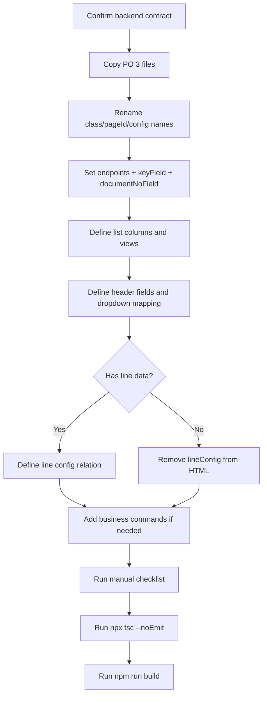
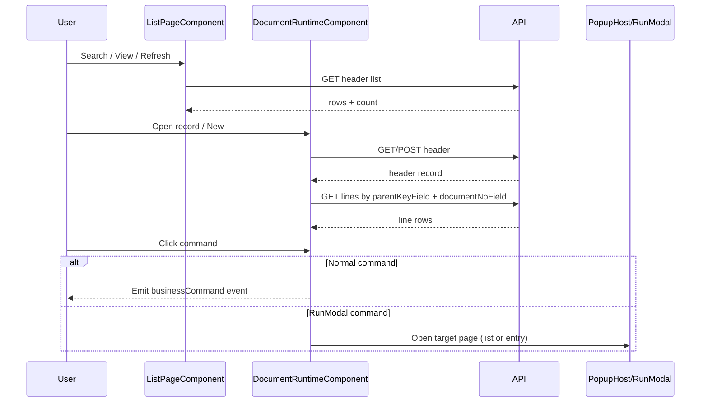
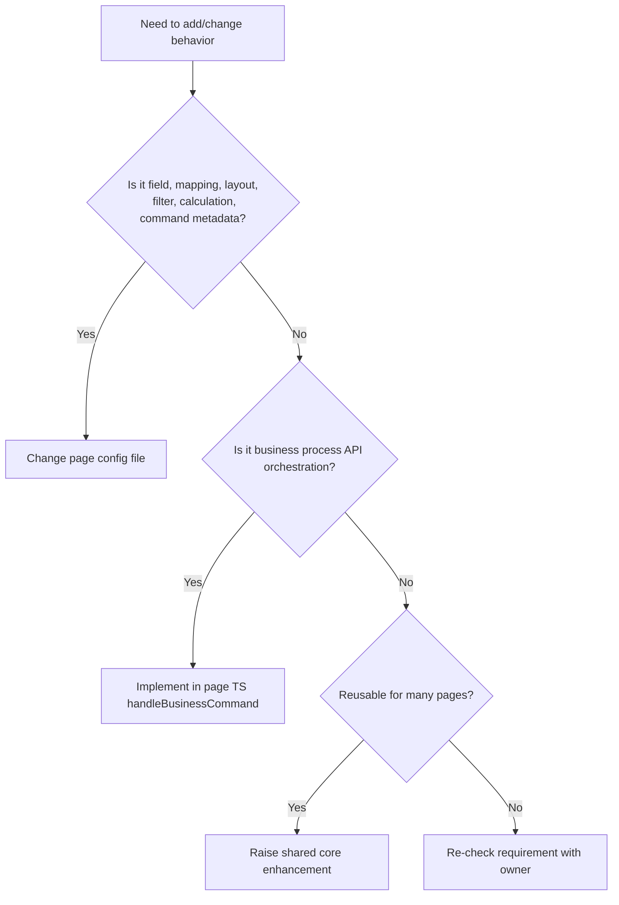

# Filaz ERP / Procure360 Page Development Master Handoff

Last updated: 2026-05-21

This is the only page-level development guide for the ERP UI. Do not create another page guide, RunModal guide, popup guide, list guide, or junior handoff. Update this file when the shared page architecture changes.

Practical companion for step-by-step implementation:

```txt
ERP_DEVELOPMENT_STEPS.md
```

The real reference page is Purchase Order. Developers should copy the Purchase Order structure first, then replace page-specific API fields, labels, buttons, and workflow config.

Real reference files:

```txt
src/app/pages/purchase-order/purchase-order.ts
src/app/pages/purchase-order/purchase-order.html
src/app/pages/purchase-order/purchase-order.config.ts
```

## 1. Main Rule

Page development is config-first.

The page config owns:

- API endpoints
- primary key field
- document number/display field
- list columns
- factbox rows
- header sections
- line columns
- dropdown API mapping
- lookup mapping
- fill mapping
- create/update payload fields
- toolbar buttons
- approval/workflow commands
- calculations
- footer totals
- validation
- permission keys

The shared core owns:

- list rendering
- shared data table
- command bar rendering
- create, update, delete, refresh
- search, filter, sort, columns, export
- entry modal runtime
- line grid runtime
- popup stack
- RunModal shell
- factbox rendering
- generic calculation engine
- generic validation
- generic error/confirmation behavior

Never hardcode one page business rule inside shared core. Core must only follow config.

## 2. Before You Start Any Page

Confirm these with the backend/business owner before coding:

```txt
[ ] Header/list API endpoint confirmed
[ ] Line API endpoint confirmed, if page has lines
[ ] API response sample confirmed
[ ] Primary key confirmed, usually systemId
[ ] Display document number confirmed, such as number/no/code/documentNo
[ ] Create payload fields confirmed
[ ] Update payload fields confirmed
[ ] Delete key confirmed
[ ] Header fields confirmed
[ ] Line fields confirmed
[ ] Line sequence field confirmed, if any
[ ] Dropdown API sources confirmed
[ ] Dropdown valueField/labelField/fill fields confirmed
[ ] List columns confirmed
[ ] Factbox fields confirmed
[ ] Buttons confirmed
[ ] Approval/workflow actions confirmed
[ ] Permissions confirmed
[ ] Validation rules confirmed
[ ] Autosave or manual save confirmed
```

If something is unknown, do not guess in core. Leave it out, add a page config TODO, or ask.

## 3. How To Create A New Document Page

Use Purchase Order as the pattern. Copy the three files and rename them.

Copy:

```txt
src/app/pages/purchase-order/purchase-order.ts
src/app/pages/purchase-order/purchase-order.html
src/app/pages/purchase-order/purchase-order.config.ts
```

To:

```txt
src/app/pages/<new-page>/<new-page>.ts
src/app/pages/<new-page>/<new-page>.html
src/app/pages/<new-page>/<new-page>.config.ts
```

Then rename these exact parts:

```txt
PurchaseOrderPage              -> YourPage
purchaseOrderListConfig        -> yourPageListConfig
purchaseOrderHeaderConfig      -> yourPageHeaderConfig
purchaseOrderLineConfig        -> yourPageLineConfig
purchaseOrderListCommandsConfig -> yourPageListCommandsConfig
pageId = 'purchase-order'      -> pageId = '<new-page>'
```

Do not invent names like `DocumentLineConfig`, `PageDocumentConfig`, or `exampleHeaderConfig`. Use the same naming chain as PO.

## 4. Real PO Page TS Pattern

This is the real working pattern. New document pages should look like this after rename.

```ts
import { Component } from '@angular/core';
import { DocumentRuntimeComponent } from '../../shared/erp-core/public-api';
import {
  purchaseOrderHeaderConfig,
  purchaseOrderLineConfig,
  purchaseOrderListConfig,
} from './purchase-order.config';

@Component({
  selector: 'app-purchase-order',
  standalone: true,
  imports: [DocumentRuntimeComponent],
  templateUrl: './purchase-order.html',
})
export class PurchaseOrderPage {
  readonly pageId = 'purchase-order';
  readonly listConfig = purchaseOrderListConfig;
  readonly headerConfig = purchaseOrderHeaderConfig;
  readonly lineConfig = purchaseOrderLineConfig;
}
```

For a new page, only rename imports, selector, class name, page id, and config names.

## 5. Real PO Page HTML Pattern

```html
<app-document-runtime
  [pageId]="pageId"
  [listConfig]="listConfig"
  [headerConfig]="headerConfig"
  [lineConfig]="lineConfig">
</app-document-runtime>
```

Do not add custom page HTML for standard ERP document pages. The shared runtime renders list, entry modal, lines, footer, commands, popup, and factbox.

## 5A. Which Page Shape Do You Need?

Choose the page shape before writing config. Do not start from TS.

### Header + Lines Document Page

Use this for Purchase Order, Sales Order, Employee Claim, and any document with one header and many rows.

```html
<app-document-runtime
  [pageId]="pageId"
  [listConfig]="listConfig"
  [headerConfig]="headerConfig"
  [lineConfig]="lineConfig"
  (businessCommand)="handleBusinessCommand($event)">
</app-document-runtime>
```

```ts
export class PurchaseOrderPage {
  readonly pageId = 'purchase-order';
  readonly listConfig = purchaseOrderListConfig;
  readonly headerConfig = purchaseOrderHeaderConfig;
  readonly lineConfig = purchaseOrderLineConfig;

  handleBusinessCommand(event: DocumentRuntimeCommandEvent): void {
    // Only add code here for real business processes.
  }
}
```

Line relation must be explicit:

```ts
dataSource: {
  endpoint: '/purchaseOrderLines',
  keyField: 'systemId',
  parentKeyField: 'documentNo',
  documentNoField: 'number',
  parentFixedFields: { documentType: 'Order' },
}
```

Meaning:

```txt
Header field number -> line field documentNo
documentType Order is copied and used as extra filter
Core must not load lines until the parent document value exists
```

### Header-Only Document Page

Use this when the page has a header/form but no line grid, for example a setup card.

```html
<app-document-runtime
  [pageId]="pageId"
  [listConfig]="listConfig"
  [headerConfig]="headerConfig"
  (businessCommand)="handleBusinessCommand($event)">
</app-document-runtime>
```

```ts
export class VendorSetupPage {
  readonly pageId = 'vendor-setup';
  readonly listConfig = vendorSetupListConfig;
  readonly headerConfig = vendorSetupHeaderConfig;

  handleBusinessCommand(event: DocumentRuntimeCommandEvent): void {
    // Usually empty unless this setup page has a custom process button.
  }
}
```

Do not create an empty fake `lineConfig`. If the page has no lines, omit `[lineConfig]`.

### List-Only Setup Page

Use this when records can be edited directly from list or simple modal behavior is enough.

```ts
export const paymentTermsListConfig: ListPageConfig & { dataSource: DataSourceConfig } = {
  title: 'Payment Terms',
  module: 'Setup',
  viewSuffix: 'payment terms',
  dataSource: {
    endpoint: '/paymentTerms',
    keyField: 'systemId',
    documentNoField: 'code',
  },
  dataSurface: {
    columns: [
      { field: 'code', label: 'Code', type: 'text', isPrimary: true },
      { field: 'description', label: 'Description', type: 'text' },
      { field: 'dueDateCalculation', label: 'Due Date Calc.', type: 'text' },
    ],
  },
};
```

### Line-Only Page

Use this only when the backend table is naturally a flat row table with no parent header. In that case, do not configure `parentKeyField`.

```ts
export const priceWorksheetLineConfig: LineConfig = {
  dataSource: {
    endpoint: '/priceWorksheetLines',
    keyField: 'systemId',
    createFields: ['itemNo', 'unitPrice', 'startingDate'],
    updateBlockedFields: ['systemId'],
  },
  columns: [
    { field: 'itemNo', label: 'Item No', cellType: 'dropdown', api: '/Items', valueField: 'no', labelField: 'description' },
    { field: 'unitPrice', label: 'Unit Price', valueType: 'number', cellType: 'text' },
    { field: 'startingDate', label: 'Starting Date', valueType: 'date', cellType: 'text' },
  ],
};
```

## 5B. When Config Is Enough And When TS Is Allowed

Use config for normal ERP behavior:

```txt
Create/save/delete
Header fields
Line fields
Dropdowns/lookups
Fill mapping
Payload fields
Factbox display
Footer totals
Validation
Calculations
Command button placement
```

Do not write TS for these:

```txt
quantity * directUnitCost
copy selected vendor name into vendor name field
line documentNo from header number
send only required create fields
hide a field from factbox
show a field in list only
```

Write page TS only for true business process work:

```txt
Send approval request
Cancel document
Reopen document
Call special posting API
Open a custom workflow popup
Call two APIs in sequence
Show a special confirmation before an action
Merge a process API response back into the active record
```

The button still belongs in config. TS only handles the action.

```ts
export const purchaseOrderListCommandsConfig: CommandConfig[] = [
  {
    id: 'po-send-approval',
    label: 'Send Approval',
    actionKey: 'cmd:send-approval',
    group: 'approval',
    icon: 'bi bi-send',
    requireSelection: true,
    selectionMode: 'single',
    permissionKey: 'PO_APPROVAL_SEND',
  },
];
```

```html
<app-document-runtime
  [pageId]="pageId"
  [listConfig]="listConfig"
  [headerConfig]="headerConfig"
  [lineConfig]="lineConfig"
  (businessCommand)="handleBusinessCommand($event)">
</app-document-runtime>
```

```ts
import { Component, inject } from '@angular/core';
import { DataSourceService, DocumentRuntimeCommandEvent, DocumentRuntimeComponent } from '../../shared/erp-core/public-api';
import {
  purchaseOrderHeaderConfig,
  purchaseOrderLineConfig,
  purchaseOrderListConfig,
} from './purchase-order.config';

@Component({
  selector: 'app-purchase-order',
  standalone: true,
  imports: [DocumentRuntimeComponent],
  templateUrl: './purchase-order.html',
})
export class PurchaseOrderPage {
  private readonly dataSource = inject(DataSourceService);

  readonly pageId = 'purchase-order';
  readonly listConfig = purchaseOrderListConfig;
  readonly headerConfig = purchaseOrderHeaderConfig;
  readonly lineConfig = purchaseOrderLineConfig;

  handleBusinessCommand(event: DocumentRuntimeCommandEvent): void {
    if (event.actionKey === 'cmd:send-approval') {
      this.sendApproval(event);
    }
  }

  private sendApproval(event: DocumentRuntimeCommandEvent): void {
    const header = event.context.headerData ?? this.asRecord(event.context.selectedRow);
    const systemId = this.toText(header?.['systemId']);
    if (!systemId) {
      return;
    }

    this.dataSource.create('/purchaseOrderHeaders/sendApproval', {
      systemId,
      number: header?.['number'],
    }).subscribe();
  }

  private asRecord(value: unknown): Record<string, unknown> | undefined {
    return value && typeof value === 'object' && !Array.isArray(value)
      ? value as Record<string, unknown>
      : undefined;
  }

  private toText(value: unknown): string {
    return value === null || value === undefined ? '' : String(value).trim();
  }
}
```

Keep this TS small. If the same business behavior is needed by many pages, discuss whether it belongs in a shared service, not inside one page component.

## 6. Page Config Import Pattern

Use only public API imports in page config.

```ts
import {
  CommandConfig,
  DataSourceConfig,
  EntryHeaderConfig,
  EntryFooterSectionConfig,
  LineConfig,
  ListPageConfig,
} from '../../shared/erp-core/public-api';
```

Do not deep import from shared internals in page files.

## 7. Real PO Config Shape

Every document page config should normally have these blocks:

```ts
export const purchaseOrderHeaderConfig: EntryHeaderConfig = {
  // header toolbar + header sections
};

export const purchaseOrderLineConfig: LineConfig = {
  // line datasource + line toolbar + line columns + calculation/footer
};

export const purchaseOrderListCommandsConfig: CommandConfig[] = [
  // extra list toolbar buttons
];

export const purchaseOrderListConfig: ListPageConfig & { dataSource: DataSourceConfig } = {
  // list metadata + views + datasource + columns
};
```

When creating a new page, keep this exact shape and rename `purchaseOrder` to the new page prefix.

## 8. List Config

Real PO list config pattern:

```ts
export const purchaseOrderListConfig: ListPageConfig & { dataSource: DataSourceConfig } = {
  title: 'Purchase Order',
  module: 'Purchase',
  company: 'Cronus International Ltd.',
  viewSuffix: 'purchase orders',
  views: [
    { id: 'all', label: 'All' },
    { id: 'open', label: 'Open', filter: "status eq 'Open'" },
    { id: 'posted', label: 'Posted', filter: "status eq 'Posted'" },
    { id: 'exception', label: 'Exception', filter: "status eq 'Exception'" },
  ],
  activeViewId: 'all',
  filterConfig: {
    enabled: true,
    storageKey: 'purchase-order-list',
  },
  commands: purchaseOrderListCommandsConfig,
  dataSource: {
    endpoint: '/purchaseOrderHeaders',
    contractProfileKey: 'purchaseOrderHeaders',
    keyField: 'systemId',
    documentNoField: 'number',
    autoGenerateNumber: true,
    lazyCreateOnFirstInput: true,
    defaultSort: 'number',
    pageSize: 20,
  },
  dataSurface: {
    columns: [
      {
        field: 'number',
        label: 'No',
        type: 'text',
        width: '84px',
        isPrimary: true,
        factPanel: { sectionId: 'details', sectionTitle: 'Details', order: 10, fallback: '-' },
      },
      {
        field: 'buyFromVendorName',
        label: 'Buy-from Vendor Name',
        type: 'text',
        width: '268px',
        subtitleField: 'buyFromVendorNumber',
        factPanel: { sectionId: 'details', sectionTitle: 'Details', order: 20, fallback: '-' },
      },
      {
        field: 'status',
        label: 'Status',
        type: 'badge',
        width: '132px',
        factPanel: { sectionId: 'details', sectionTitle: 'Details', order: 50, fallback: '-' },
      },
    ],
  },
};
```

To create another list, replace only:

```txt
title
module
viewSuffix
views
filterConfig.storageKey
commands
dataSource.endpoint
dataSource.contractProfileKey
dataSource.keyField
dataSource.documentNoField
dataSource.defaultSort
dataSurface.columns
```

Normal ERP list pages do not need to repeat these defaults:

```txt
supportsCreate: true
supportsUpdate: true
supportsDelete: true
tools.refresh: true
tools.filter: true
tools.advancedFilter: true
tools.export: true
tools.columns: true
```

Only define false/exception values when required.

## 9. Primary Key And Document Number

Use `systemId` as `keyField` when the API has it.

```ts
dataSource: {
  endpoint: '/purchaseOrderHeaders',
  keyField: 'systemId',
  documentNoField: 'number',
}
```

Meaning:

```txt
keyField = persisted API identity for PATCH/DELETE
documentNoField = business display/search number
```

Examples:

```txt
Purchase Order keyField: systemId
Purchase Order documentNoField: number
Setup page keyField: systemId
Setup page documentNoField: code
Document line keyField: systemId
Document line parentKeyField: documentNo
Document line documentNoField: number
```

Do not use display number for update/delete if `systemId` exists.

For header + line pages, `parentKeyField` is the field on the line API and `documentNoField`
is the field on the header API that supplies that value. The core must never load child
lines from `parentFixedFields` alone. If a document is new and the parent document number
is not available yet, the line grid starts empty instead of loading unrelated old lines.

## 10. List Columns And Shared Data Table

Columns are defined in `dataSurface.columns`.

```ts
{
  field: 'amountIncludingVAT',
  label: 'Amount Including VAT',
  type: 'currency',
  width: '164px',
  align: 'end',
  factPanel: { sectionId: 'amounts', sectionTitle: 'Amounts', order: 20, fallback: '0' },
}
```

Rules:

```txt
field = API field
label = grid header
type = text/number/date/boolean/currency/badge
width = stable enterprise layout
align: 'end' = numbers and currency
isPrimary = main display column
subtitleField = secondary text below primary value
hidden: true = hide from grid but still can show in factbox
factPanel = show in right factbox
```

Recommended widths:

```txt
No/document number: 84px to 120px
Vendor/name/text with subtitle: 220px to 280px
Date: 132px
Number/currency: 146px
Badge/status: 132px
Boolean: 120px
Normal text: 156px to 190px
```

## 11. Factbox Rules

Factbox is config-driven.

List and factbox:

```ts
{
  field: 'status',
  label: 'Status',
  type: 'badge',
  width: '132px',
  factPanel: { sectionId: 'details', sectionTitle: 'Details', order: 50, fallback: '-' },
}
```

Factbox only:

```ts
{
  field: 'createdBy',
  label: 'Created By',
  type: 'text',
  hidden: true,
  factPanel: { sectionId: 'system', sectionTitle: 'System', order: 20 },
}
```

List only:

```ts
{
  field: 'amount',
  label: 'Amount',
  type: 'currency',
  align: 'end',
}
```

Rules:

```txt
hidden: true hides from list only
factPanel shows in factbox
no factPanel means not in factbox
order controls factbox row order only
sectionId groups rows
sectionTitle displays section heading
fallback shows when value is empty
```

Do not create separate factbox arrays when `dataSurface.columns` can own it.

Entry fact panel custom button:

```ts
{
  key: 'status',
  label: 'Status',
  type: 'badge',
  valueType: 'text',
  readonly: true,
  factPanel: {
    sectionId: 'review',
    sectionTitle: 'Review',
    order: 10,
    fallback: 'Open',
    buttons: [
      {
        id: 'review-history',
        label: 'History',
        actionKey: 'cmd:review-history',
        surface: 'factPanel',
        icon: 'bi bi-clock-history',
        permissionKey: 'PO_REVIEW_HISTORY',
      },
    ],
  },
}
```

The button is rendered by core. If it only opens a configured RunModal, use `runModalPageId`.
If it calls a business API, handle the `actionKey` in page TS through `(businessCommand)`.

## 12. Header Config

Real PO header config pattern:

```ts
export const purchaseOrderHeaderConfig: EntryHeaderConfig = {
  dialogTitle: 'Purchase Order',
  toolbarButtons: [
    {
      label: 'Release',
      actionKey: 'cmd:release',
      group: 'Process',
      isPrimary: true,
      order: 10,
      icon: 'bi bi-arrow-repeat',
    },
    {
      label: 'Send Approval Request',
      actionKey: 'cmd:SendApprovalRequest',
      group: 'Approval',
      order: 40,
      icon: 'bi bi-send',
    },
  ],
  sections: [
    {
      id: 'header-main',
      title: 'Primary Details',
      fields: [
        {
          key: 'number',
          label: 'No',
          type: 'text',
          valueType: 'text',
          readonly: true,
          factPanel: { sectionId: 'document', sectionTitle: 'Document', order: 10, fallback: '-' },
        },
        {
          key: 'buyFromVendorNumber',
          label: 'Vendor No',
          type: 'dropdown',
          valueType: 'text',
          api: ['/vendorsAPI', '/vendors'],
          valueField: 'number',
          labelField: 'name',
          fill: {
            buyFromVendorName: 'name',
          },
        },
        {
          key: 'buyFromVendorName',
          label: 'Vendor Name',
          type: 'text',
          valueType: 'text',
          readonly: true,
        },
      ],
    },
  ],
};
```

To create a new header:

```txt
1. Keep dialogTitle.
2. Add toolbarButtons from business button list.
3. Create sections.
4. Add fields using API keys.
5. For dropdowns, define api/valueField/labelField/fill.
6. Add factPanel only for fields that must appear in entry fact panel.
```

Header design rules:

```txt
Use real API field names as key.
Use sections to group business meaning, not visual decoration.
Readonly system fields can stay in header if users need to see them.
Dropdown fields must define api, valueField, labelField, and fill when they update another field.
Do not put payload code in the header component.
Do not create custom HTML for normal header layout.
```

Header-only page:

```ts
export const vendorSetupHeaderConfig: EntryHeaderConfig = {
  dialogTitle: 'Vendor Setup',
  toolbarButtons: [],
  sections: [
    {
      id: 'general',
      title: 'General',
      fields: [
        { key: 'code', label: 'Code', type: 'text', valueType: 'text', required: true },
        { key: 'description', label: 'Description', type: 'text', valueType: 'text' },
        { key: 'blocked', label: 'Blocked', type: 'boolean', valueType: 'boolean' },
      ],
    },
  ],
};
```

## 13. Line Config

Real PO line config pattern:

```ts
export const purchaseOrderLineConfig: LineConfig = {
  placement: {
    mode: 'after-section',
    afterSectionId: 'header-main',
  },
  dataSource: {
    endpoint: '/purchaseOrderLines',
    keyField: 'systemId',
    parentKeyField: 'documentNo',
    documentNoField: 'number',
    parentFixedFields: { documentType: 'Order' },
    createFields: ['documentType', 'documentNo', 'lineNo', 'type', 'no', 'quantity'],
    updateBlockedFields: ['systemId', 'id', 'documentNo', 'lineNo'],
    defaultSort: 'lineNo',
  },
  lineKeyField: 'lineNo',
  toolbarButtons: [
    { label: 'Line', actionKey: 'cmd:line-new', group: 'Process', isPrimary: true, order: 10, icon: 'bi bi-plus-lg' },
    { label: 'Insert', actionKey: 'cmd:line-insert', group: 'Process', order: 20 },
    { label: 'Delete', actionKey: 'cmd:line-delete', group: 'Process', order: 25, icon: 'bi bi-trash' },
  ],
  columns: [
    {
      id: 'type',
      label: 'Type',
      field: 'type',
      valueType: 'text',
      cellType: 'dropdown',
      options: [
        { label: 'G/L Account', value: 'G/L Account', api: '/glAccounts' },
        { label: 'Item', value: 'Item', api: '/Items' },
        { label: 'Fixed Asset', value: 'Fixed Asset', api: '/fixedAssets' },
        { label: 'Comment', value: ' ' },
      ],
    },
    {
      id: 'no',
      label: 'No',
      field: 'no',
      valueType: 'text',
      cellType: 'dropdown',
      valueField: ['no', 'number', 'code'],
      labelField: ['description', 'name'],
      fill: {
        description: 'description',
        unitOfMeasure: ['baseUnitOfMeasure', 'unitOfMeasureCode'],
        directUnitCost: ['directUnitCost', 'unitCost', 'unitPrice'],
      },
    },
  ],
};
```

For a new line page:

```txt
1. Replace endpoint.
2. Replace keyField.
3. Replace parentKeyField.
4. Remove parentFixedFields if not needed.
5. Replace createFields.
6. Replace updateBlockedFields.
7. Add lineKeyField only if the API has a line sequence.
8. Replace columns.
9. Configure dropdown valueField/labelField/fill.
10. Add calculation/footer only if needed.
```

Do not force `lineNo` into a module that does not have line sequence.

Line design rules:

```txt
Use columns for every editable/display line field.
Use parentKeyField only when lines belong to a header.
Use documentNoField to say which header field supplies the parent key.
Use parentFixedFields only for extra fixed payload values.
Use createFields to control POST payload.
Use updateBlockedFields to prevent system/parent fields being patched.
Use fill on dropdown columns when selecting one field should populate other fields.
Do not hardcode item/vendor/UOM field names in core.
```

Employee Claim line example:

```ts
export const employeeClaimLineConfig: LineConfig = {
  dataSource: {
    endpoint: '/employeeClaimLines',
    keyField: 'systemId',
    parentKeyField: 'claimNo',
    documentNoField: 'number',
    createFields: ['claimNo', 'expenseType', 'claimDate', 'amount'],
    updateBlockedFields: ['systemId', 'claimNo'],
  },
  columns: [
    {
      field: 'expenseType',
      label: 'Expense Type',
      cellType: 'dropdown',
      api: '/expenseTypes',
      valueField: 'code',
      labelField: 'description',
      fill: {
        expenseDescription: 'description',
      },
    },
    { field: 'claimDate', label: 'Claim Date', valueType: 'date', cellType: 'text' },
    { field: 'amount', label: 'Amount', valueType: 'number', cellType: 'text', align: 'end' },
  ],
};
```

## 14. Dropdowns And Lookups

Dropdowns must be explicit. Core does not guess source fields.

Real PO vendor dropdown:

```ts
{
  key: 'buyFromVendorNumber',
  label: 'Vendor No',
  type: 'dropdown',
  valueType: 'text',
  api: ['/vendorsAPI', '/vendors'],
  valueField: 'number',
  labelField: 'name',
  fill: {
    buyFromVendorName: 'name',
  },
}
```

Real PO line master dropdown:

```ts
{
  id: 'no',
  label: 'No',
  field: 'no',
  cellType: 'dropdown',
  valueField: ['no', 'number', 'code'],
  labelField: ['description', 'name'],
  fill: {
    description: 'description',
    unitOfMeasure: ['baseUnitOfMeasure', 'unitOfMeasureCode'],
    directUnitCost: ['directUnitCost', 'unitCost', 'unitPrice'],
  },
}
```

Rules:

```txt
api = endpoint(s) for options
valueField = saved value
labelField = display value
fill = target field -> source field from selected record
displayFormat = optional UI-only display format
```

Do not store combined text like `10000 - Vendor Name` into a value field.

Lookup pattern if a page needs search/open-card style:

```ts
{
  key: 'projectCode',
  label: 'Project',
  type: 'lookup',
  lookup: {
    endpoint: '/projects',
    valueField: 'code',
    displayField: 'name',
    searchFields: ['code', 'name'],
    allowOpenCard: true,
  },
}
```

## 15. Payload Mapping

Create/update/delete must come from config.

Header/list:

```ts
dataSource: {
  endpoint: '/purchaseOrderHeaders',
  keyField: 'systemId',
  documentNoField: 'number',
  createFields: ['buyFromVendorNumber', 'postingDate', 'documentDate'],
  updateBlockedFields: ['systemId', 'number'],
}
```

Line:

```ts
dataSource: {
  endpoint: '/purchaseOrderLines',
  keyField: 'systemId',
  parentKeyField: 'documentNo',
  documentNoField: 'number',
  parentFixedFields: { documentType: 'Order' },
  createFields: ['documentType', 'documentNo', 'lineNo', 'type', 'no', 'quantity'],
  updateBlockedFields: ['systemId', 'id', 'documentNo', 'lineNo'],
}
```

Meaning:

```txt
parentKeyField = line API field that stores the parent document number
documentNoField = header API field that provides that parent document number
parentFixedFields = extra fields copied to line payload and added to line query
```

Rule: `parentFixedFields` only narrows the query after the parent key is known. It must
not be used alone, because that would load lines from other documents.

Create payload example from PO:

```json
{
  "documentType": "Order",
  "documentNo": "103069",
  "lineNo": 10000,
  "type": "Item",
  "no": "1896-S",
  "quantity": 2
}
```

Update payload example:

```json
{
  "quantity": 5,
  "lineAmount": 500
}
```

Delete:

```txt
DELETE /purchaseOrderLines(systemId)
```

## 16. Calculations And Footer

Real PO row calculation:

```ts
calculation: [
  {
    target: 'lineAmount',
    formula: 'quantity * directUnitCost',
  },
  {
    target: 'amountToInvoice',
    formula: 'lineAmount',
  },
],
```

UOM/currency style:

```ts
calculation: [
  {
    target: 'lineAmount',
    formula: 'quantity * uomFactor * directUnitCost',
  },
  {
    target: 'localAmount',
    formula: 'lineAmount * header.currencyFactor',
  },
],
```

Footer totals:

```ts
totalsCalculation: {
  defaults: {
    subtotal: '0.00',
    sst: '0.00',
    total: '0.00',
    difference: '0.00',
  },
  format: {
    type: 'currency',
    currencyCodeHeaderField: 'currencyCode',
  },
  totals: {
    subtotal: { formula: 'sum(lineAmount)' },
    sst: { kind: 'default' },
    total: { formula: 'sum(lineAmount)' },
    difference: { formula: 'sum(lineAmount) - sum(amountInvoiced)' },
  },
},
```

Footer labels:

```ts
footerSections: [
  {
    id: 'document-totals',
    rows: [
      { id: 'amount-excl-sst', label: 'Amount Excl. SST', source: 'total', totalKey: 'subtotal', order: 10 },
      { id: 'sst', label: 'SST', source: 'total', totalKey: 'sst', order: 20 },
      { id: 'total-incl-sst', label: 'Total Incl. SST', source: 'total', totalKey: 'total', emphasis: true, order: 30 },
    ],
  },
],
```

Rules:

```txt
Formula fields must be real config/API fields.
Core evaluates formulas but does not know business math.
Do not put quantity * cost in page TS.
If a page does not need calculation, omit calculation.
If a page does not need footer, omit totalsCalculation and footerSections.
```

No footer page:

```ts
export const employeeClaimLineConfig: LineConfig = {
  dataSource: {
    endpoint: '/employeeClaimLines',
    keyField: 'systemId',
    parentKeyField: 'claimNo',
    documentNoField: 'number',
    createFields: ['claimNo', 'expenseType', 'amount'],
    updateBlockedFields: ['systemId', 'claimNo'],
  },
  columns: [
    { field: 'expenseType', label: 'Expense Type', cellType: 'dropdown', api: '/expenseTypes', valueField: 'code', labelField: 'description' },
    { field: 'amount', label: 'Amount', valueType: 'number', cellType: 'text', align: 'end' },
  ],
};
```

Do not add empty `totalsCalculation: {}` or empty `footerSections: []`. Omit both keys.

## 17. Commands And App Actions

PO list commands:

```ts
export const purchaseOrderListCommandsConfig: CommandConfig[] = [
  {
    id: 'po-review',
    label: 'Review',
    actionKey: 'cmd:po-review',
    group: 'process',
    icon: 'bi bi-check2-square',
  },
  {
    id: 'po-send',
    label: 'Send',
    actionKey: 'cmd:po-send',
    group: 'process',
    icon: 'bi bi-send',
  },
  {
    id: 'po-print',
    label: 'Print',
    actionKey: 'cmd:po-print',
    group: 'documents',
    icon: 'bi bi-printer',
  },
];
```

Command contract:

```ts
{
  id?: string;
  label: string;
  actionKey: string;
  surface?: 'list' | 'header' | 'line' | 'detail' | 'factPanel';
  group?: string;
  icon?: string;
  order?: number;
  isPrimary?: boolean;
  tone?: 'primary' | 'normal' | 'danger';
  disabled?: boolean;
  hidden?: boolean;
  runModalPageId?: string;
  runModalTarget?: 'list' | 'entry';
  requireSelection?: boolean;
  selectionMode?: 'single' | 'multiple';
  permissionKey?: string;
}
```

Rules:

```txt
New/Delete/Refresh are core standard actions.
Do not duplicate New/Delete/Refresh in custom commands.
Custom buttons are for real process/document/workflow actions.
Button actionKey should be stable.
Business implementation can be added later in page layer.
```

## 18. Approval And Workflow

Approval is command config plus page/business handler.

PO-style approval button:

```ts
{
  label: 'Send Approval Request',
  actionKey: 'cmd:SendApprovalRequest',
  group: 'Approval',
  order: 40,
  icon: 'bi bi-send',
  permissionKey: 'PO_APPROVAL_SEND',
}
```

When workflow is implemented, page layer calls API. Do not put PO approval endpoint in shared core.

Expected request shape:

```txt
POST /purchaseOrderHeaders({systemId})/sendApproval
```

Expected response shape:

```json
{
  "systemId": "db5f9d35-5eec-f011-8405-7ced8de4f3f2",
  "number": "103069",
  "status": "Pending Approval",
  "pendingApproversId": "MANAGER01"
}
```

After success, merge response or refresh the active record.

## 19. Popup / RunModal / Drawer

Use shared popup engine for ERP modals. Do not create a new modal shell for one page.

RunModal command pattern:

```ts
{
  id: 'approval-history',
  label: 'Approval History',
  actionKey: 'cmd:approval-history',
  surface: 'header',
  group: 'Approval',
  icon: 'bi bi-clock-history',
  runModalPageId: 'approval-history',
  runModalTarget: 'entry',
}
```

Extra page command examples (normal + RunModal):

```ts
commands: [
  {
    id: 'send-approval',
    label: 'Send Approval',
    actionKey: 'cmd:send-approval',
    surface: 'list',
    group: 'process',
    icon: 'bi bi-send',
    requireSelection: true,
    selectionMode: 'single'
  },
  {
    id: 'prepayment',
    label: 'Pre payment',
    actionKey: 'cmd:prepayment',
    surface: 'header',
    group: 'process',
    icon: 'bi bi-credit-card',
    runModalPageId: 'prepayment',
    runModalTarget: 'entry'
  }
]
```

One common base command contract:

```ts
export interface ErpCommandConfig {
  id?: string;
  label: string;
  actionKey: string;

  surface?: 'list' | 'header' | 'line' | 'detail' | 'factPanel';
  group?: string;
  icon?: string;
  trailingIcon?: string;
  order?: number;
  isPrimary?: boolean;
  tone?: 'primary' | 'normal' | 'danger';

  disabled?: boolean;
  hidden?: boolean;

  runModalPageId?: string;
  runModalTarget?: 'list' | 'entry';

  requireSelection?: boolean;
  selectionMode?: 'single' | 'multiple';

  tooltip?: string;
  permissionKey?: string;
}
```


Use:

```txt
runModalTarget: 'list'  when user must choose a record
runModalTarget: 'entry' when active context opens one record safely
```

Drawer usage:

```txt
Use drawer for temporary side tools such as advanced filters.
Use factbox for read-only contextual information.
Use popup/RunModal for ERP modal workflows.
```

## 20. Filters, Search, Sorting

Views:

```ts
views: [
  { id: 'all', label: 'All' },
  { id: 'open', label: 'Open', filter: "status eq 'Open'" },
]
```

Search:

```ts
searchFields: ['number', 'buyFromVendorName', 'vendorInvoiceNumber'],
searchPlaceholder: 'Search purchase orders...',
```

Sort:

```ts
dataSource: {
  defaultSort: 'number',
}
```

Rules:

```txt
filter = standard views/search/quick filters
advancedFilter = panel builder with field/operator/value/bookmarks
server-side filter/sort should follow API support
large lists should use pageSize and infinite scroll only when API supports paging
```

## 21. Validation

Validation belongs in field config.

```ts
{
  key: 'prepayment',
  label: 'Pre payment %',
  type: 'number',
  valueType: 'number',
  validation: {
    min: 0,
    max: 100,
    message: 'Pre payment must be between 0 and 100.',
  },
}
```

Required field:

```ts
{
  key: 'postingDate',
  label: 'Posting Date',
  type: 'date',
  valueType: 'date',
  required: true,
}
```

Validation flow:

```txt
user changes field
core validates field config
invalid value is blocked or rolled back
shared status/error message is shown
valid value saves based on runtime save mode
```

## 22. Permissions

Use `permissionKey` on commands now so security can attach later.

```ts
{
  id: 'po-send',
  label: 'Send',
  actionKey: 'cmd:po-send',
  permissionKey: 'PO_SEND',
}
```

Future logic:

```txt
show command when command.hidden !== true and user has permissionKey
```

Do not hardcode roles in shared components.

## 23. Routing And Menu

Add route:

```ts
{
  path: 'purchase-order',
  loadComponent: () =>
    import('./pages/purchase-order/purchase-order').then((m) => m.PurchaseOrderPage),
}
```

For a new page, copy route and rename path/import/class.

Add menu entry in the current menu config/service:

```ts
{
  id: 'purchase-order',
  label: 'Purchase Order',
  route: '/purchase-order',
  module: 'Purchase',
}
```

Do not leave routes or menu entries pointing to deleted pages.

## 24. Setup Page: Follow Same Config, No Lines

If creating a setup page, still follow the list config pattern. It is list-only and does not need `DocumentRuntimeComponent`.

Use `ListPageComponent`, `ListPageConfig`, and `dataSurface.columns`.

Required setup replacements:

```txt
title
module
viewSuffix
dataSource.endpoint
dataSource.keyField
dataSource.documentNoField
dataSurface.columns
supportsDelete false if delete not allowed
```

## 25. Employee Claim: Follow PO, Replace Fields

Do not create a new architecture for Employee Claim. Copy PO document page and replace config.

Mapping guide:

```txt
purchaseOrderHeaderConfig -> employeeClaimHeaderConfig
purchaseOrderLineConfig -> employeeClaimLineConfig
purchaseOrderListConfig -> employeeClaimListConfig
purchaseOrderHeaders endpoint -> employeeClaims endpoint
purchaseOrderLines endpoint -> employeeClaimLines endpoint
number -> claimNo
buyFromVendorNumber/name -> employeeNo/name
PO amount fields -> claim amount fields
PO approval buttons -> claim approval buttons
```

Claim formulas still use the same calculation engine:

```ts
calculation: [
  { target: 'claimAmount', formula: 'quantity * unitPrice' },
  { target: 'localAmount', formula: 'claimAmount * header.currencyFactor' },
],
```

This is not a separate pattern. It is PO structure with different fields.

## 26. Error Handling, Confirmation, Loader

Rules:

```txt
Use shared confirmation for delete/destructive actions.
Use shared error/status handling.
Do not call SweetAlert directly from every page.
Show loader for list load, refresh, save, delete, popup load.
Line save should not block the whole application.
Backend error message should be shown when available.
```

Delete flow:

```txt
click Delete
confirm
DELETE by keyField
remove locally or refresh
show success/error
```

## 27. UX Standards

Follow Business Central-style enterprise UI:

```txt
dense but readable
stable row height
predictable toolbar
icons for actions
status as badge
numbers right aligned
factbox for contextual details
no decorative page-specific styling
no random colors
no nested cards inside cards
no page-specific SCSS unless shared engine cannot support it
```

## 28. When To Use Custom HTML

Use shared engine for:

```txt
ERP list pages
document header/line pages
setup tables
standard modal flows
factboxes
filters
command bars
```

Use custom HTML only when:

```txt
page is not a standard ERP page
workflow is not representable by list/header/line config
shared component lacks a genuinely generic capability
```

If custom HTML is needed, first ask whether the missing behavior should be added generically to shared core.

## 29. Common Mistakes

Do not:

```txt
hardcode page field names in core
copy old app TS into new page TS
create another config naming style
duplicate New/Delete/Refresh custom buttons
use display number as update/delete key when systemId exists
force lineNo into non-line-sequence pages
assume every API has number/code/description
use displayName unless API really returns displayName
store combined dropdown label as the saved value
create page-specific SCSS for shared controls
create another handoff document
```

## 30. Verification

Run:

```bash
npx tsc --noEmit
```

Manual test:

```txt
[ ] route opens
[ ] list loads
[ ] search works
[ ] views filter
[ ] sort works
[ ] refresh works
[ ] new opens entry
[ ] header edit saves
[ ] dropdown fills target fields
[ ] line add works
[ ] line edit saves
[ ] line delete confirms and deletes
[ ] calculations update
[ ] footer totals update
[ ] factbox updates
[ ] popup opens/closes cleanly
[ ] API errors show cleanly
```

Build:

```bash
npm run build
```

If build fails only on Angular bundle/style budgets, report that separately from TypeScript errors.

## 31. Current Status

```txt
Purchase Order is the real reference page.
Purchase Invoice and Prepayment are not active reference pages now.
Deleted pages must not remain in routes or RunModal loaders.
Core dropdown/master mapping is config-owned.
Normal page development should not require core edits.
```

## 32. Core Benefits Already Supported (Often Missed)

These are already available in shared core and can be used directly from page config.

1. Multi-endpoint fallback for dropdown options:

```ts
api: ['/vendorsAPI', '/vendors']
```

2. Multi-candidate value/label field mapping:

```ts
valueField: ['no', 'number', 'code'],
labelField: ['description', 'name']
```

3. Multi-source fill mapping from selected dropdown record:

```ts
fill: {
  unitOfMeasure: ['baseUnitOfMeasure', 'unitOfMeasureCode'],
  directUnitCost: ['directUnitCost', 'unitCost', 'unitPrice'],
}
```

4. Field target mapping with fallback and clear behavior:

```ts
targets: [
  {
    key: 'vendorName',
    source: 'name',
    fallbackSources: ['description'],
    clearOnEmpty: true,
  },
]
```

5. Lookup-style field support (search and open-card pattern) via `type: 'lookup'` + `lookup` config.

6. Entry and list fact panel are both config-driven:

1. List side: `dataSurface.columns[].factPanel`
2. Entry side: `fields[].factPanel`

7. Command selection enforcement is built-in:

```ts
requireSelection: true,
selectionMode: 'single'
```

8. RunModal target routing is built-in:

```ts
runModalTarget: 'list' | 'entry'
```

9. Legacy alias support exists for RunModal target:

```ts
runModalView: 'list' | 'entry'
```

10. Draft-on-first-input flow exists for document pages:

```ts
autoGenerateNumber: true,
lazyCreateOnFirstInput: true
```

11. Line placement modes are built-in:

```ts
placement: { mode: 'after-section', afterSectionId: 'header-main' }
// or
placement: { mode: 'end' }
```

12. Advanced filter UI supports saved bookmarks and field operators without page TS.

13. `optionsSkipWhenSuperAdmin` is supported for dropdown option loading control.

14. Totals formula engine supports:

```txt
row.<field>
header.<field>
sum(<field>)
+ - * / %
```

## 33. Exception and Edge-case Playbook

Use these rules when real projects do not match ideal samples.

1. If API has no `systemId`:

1. Use real persisted unique key as `keyField`.
2. Do not use display-only text as update/delete key unless backend confirms it is stable and unique.

2. If line table has no line sequence (`lineNo`):

1. Omit `lineKeyField`.
2. Do not force `lineNo` into create/update fields.

3. If page is header-only:

1. Omit `[lineConfig]` in HTML.
2. Do not create fake line config.

4. If page needs true line-only runtime:

1. Current shared `DocumentRuntimeComponent` expects header config.
2. Use minimal technical header as workaround, or raise core enhancement task.

5. If API does not support paging/filter/sort:

1. Keep `pageSize` conservative.
2. Do not assume large infinite scroll behavior.
3. Coordinate backend contract first.

6. If dropdown payload schema differs by endpoint:

1. Use array-based `valueField` and `labelField` fallbacks.
2. Use multi-endpoint `api` fallback list.

7. If command opens wrong popup mode:

1. Use `runModalTarget: 'list'` when user must pick a record first.
2. Use `runModalTarget: 'entry'` for active-context single record flow.

8. If child lines load unrelated rows:

1. Verify `parentKeyField` and `documentNoField` mapping.
2. Do not rely on `parentFixedFields` alone.

9. If create returns success but list shows zero:

1. Clear active view/search/advanced filters.
2. Verify list request includes correct company context.
3. Verify persisted key/document number mapping in config.

10. If junior is unsure whether code belongs in TS:

1. If it is field/payload/layout/lookup/calculation -> config.
2. If it is business process orchestration API call -> page TS handler.

## 34. How To Apply In Real Project (Step-by-step)

If you are confused where to start, follow this exact sequence.



Implementation checklist with file ownership:

1. Create page folder and copy PO base files.
2. In `<new-page>.ts`: rename class, `pageId`, and imported config names only.
3. In `<new-page>.html`: keep only `<app-document-runtime ...>`; do not add custom layout.
4. In `<new-page>.config.ts`: first set `dataSource.endpoint`, `keyField`, `documentNoField`.
5. Add list columns from confirmed API fields.
6. Add header sections/fields and dropdown mapping.
7. Add line config only when backend really has line endpoint.
8. Add commands only for real business process, not for duplicate New/Delete/Refresh.
9. Add route + menu entry.
10. Execute verification sequence.

## 35. Working Example: Employee Claim (Copy, Rename, Replace)

Use this when implementing Employee Claim from PO blueprint.

### 35.1 employee-claim.ts

```ts
import { Component } from '@angular/core';
import {
  DocumentRuntimeCommandEvent,
  DocumentRuntimeComponent,
} from '../../shared/erp-core/public-api';
import {
  employeeClaimHeaderConfig,
  employeeClaimLineConfig,
  employeeClaimListConfig,
} from './employee-claim.config';

@Component({
  selector: 'app-employee-claim',
  standalone: true,
  imports: [DocumentRuntimeComponent],
  templateUrl: './employee-claim.html',
})
export class EmployeeClaimPage {
  readonly pageId = 'employee-claim';
  readonly listConfig = employeeClaimListConfig;
  readonly headerConfig = employeeClaimHeaderConfig;
  readonly lineConfig = employeeClaimLineConfig;

  handleBusinessCommand(event: DocumentRuntimeCommandEvent): void {
    if (event.actionKey === 'cmd:send-approval') {
      // Call claim approval API here. Keep page-specific process in page layer.
    }
  }
}
```

### 35.2 employee-claim.html

```html
<app-document-runtime
  [pageId]="pageId"
  [listConfig]="listConfig"
  [headerConfig]="headerConfig"
  [lineConfig]="lineConfig"
  (businessCommand)="handleBusinessCommand($event)">
</app-document-runtime>
```

### 35.3 employee-claim.config.ts (minimal but real)

```ts
import { DataSourceConfig, EntryHeaderConfig, LineConfig, ListPageConfig } from '../../shared/erp-core/public-api';

export const employeeClaimListConfig: ListPageConfig & { dataSource: DataSourceConfig } = {
  title: 'Employee Claims',
  module: 'Finance',
  viewSuffix: 'claims',
  dataSource: {
    endpoint: '/employeeClaims',
    keyField: 'systemId',
    documentNoField: 'claimNo',
    defaultSort: 'claimNo',
  },
  dataSurface: {
    columns: [
      { field: 'claimNo', label: 'Claim No.', type: 'text', isPrimary: true },
      { field: 'employeeName', label: 'Employee', type: 'text', subtitleField: 'employeeNo' },
      { field: 'status', label: 'Status', type: 'badge' },
      { field: 'totalAmount', label: 'Total', type: 'currency' },
    ],
  },
  views: [
    { id: 'all', label: 'All' },
    { id: 'open', label: 'Open', filter: "status eq 'Open'" },
  ],
  searchFields: ['claimNo', 'employeeNo', 'employeeName'],
};

export const employeeClaimHeaderConfig: EntryHeaderConfig = {
  title: 'Employee Claim Card',
  dialogTitle: 'Employee Claim',
  dataSource: {
    endpoint: '/employeeClaims',
    keyField: 'systemId',
    documentNoField: 'claimNo',
  },
  sections: [
    {
      id: 'main',
      title: 'General',
      fields: [
        { key: 'claimNo', label: 'Claim No.', type: 'text', readonly: true },
        {
          key: 'employeeNo',
          label: 'Employee No.',
          type: 'dropdown',
          options: {
            api: ['/employeesAPI', '/employees'],
            valueField: ['no', 'employeeNo'],
            labelField: ['name', 'description'],
            fill: { employeeName: ['name', 'description'] },
          },
          required: true,
        },
        { key: 'employeeName', label: 'Employee Name', type: 'text', readonly: true },
      ],
    },
  ],
};

export const employeeClaimLineConfig: LineConfig = {
  dataSource: {
    endpoint: '/employeeClaimLines',
    keyField: 'systemId',
    parentKeyField: 'documentNo',
    documentNoField: 'claimNo',
  },
  columns: [
    { key: 'expenseType', label: 'Expense Type', type: 'text' },
    { key: 'quantity', label: 'Qty', type: 'number' },
    { key: 'unitPrice', label: 'Unit Price', type: 'number' },
    { key: 'claimAmount', label: 'Claim Amount', type: 'number', readonly: true },
  ],
  calculation: [
    { target: 'claimAmount', formula: 'quantity * unitPrice' },
  ],
};
```

## 36. Visual: Runtime Data Flow

Use this to understand where bug belongs before editing anything.



## 37. Fast Decision Tree (When Need What)



## 38. Practical Troubleshooting With Exact Fix Location

1. Symptom: Create success toast, but list still empty.
1. Check active view/search/filter in list state.
2. Verify list `dataSource.endpoint` company scope.
3. Verify `documentNoField` and `keyField` in list config.

2. Symptom: Lines do not appear after opening header.
1. Verify line `parentKeyField` equals actual line foreign key.
2. Verify line `documentNoField` points to header document field.
3. Confirm header has document value before line fetch.

3. Symptom: Dropdown shows text but saves wrong value.
1. Fix `valueField` mapping.
2. Keep `labelField` for display only.
3. Use `fill` for extra fields instead of concatenated storage.

4. Symptom: RunModal opens wrong screen mode.
1. Use `runModalTarget: 'list'` for picker selection flow.
2. Use `runModalTarget: 'entry'` for current-context card flow.

5. Symptom: Junior added logic in shared core for one page only.
1. Move page-specific rule to page config or page TS.
2. Keep shared core generic.
