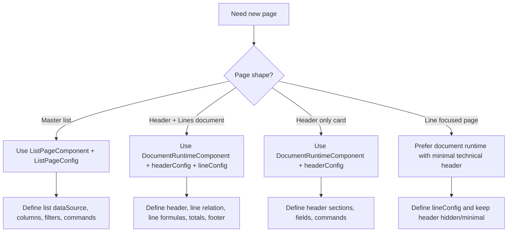
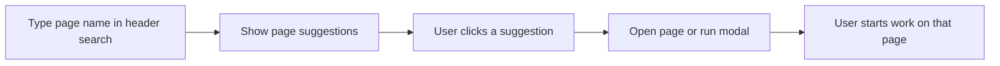
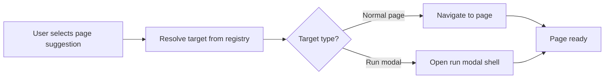
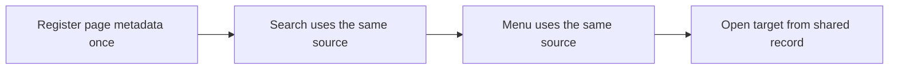
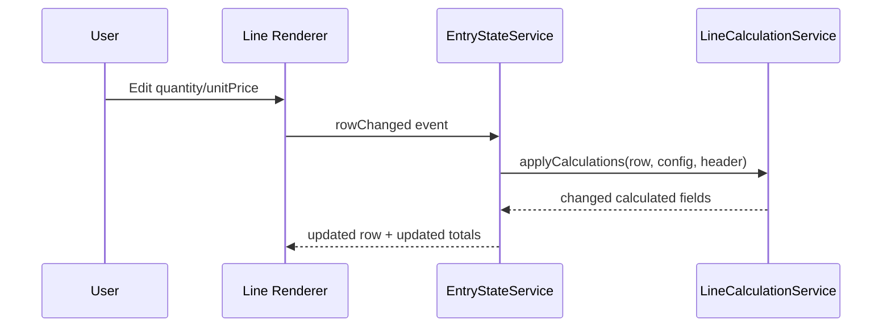

# ERP Development Steps Playbook (Practical)

Last updated: 2026-06-08

This is a companion practical document.
Use this with ERP_CORE_HANDOFF.md.

Goal:
- A junior developer should open this file and start implementing pages immediately.
- Cover all required page shapes and core support points.

Template source folder in this repo:
- src/app/pages/dummy-page
- Per-page configs:
- src/app/pages/dummy-page/dummy-master.config.ts
- src/app/pages/dummy-page/dummy-header-line.config.ts
- src/app/pages/dummy-page/dummy-header-only.config.ts
- src/app/pages/dummy-page/dummy-line-only.config.ts

---

## 0) Quick Start Map (What to build when)



---

## 0A) First Feature: Global Search / Page Launcher

Use when:
- The user needs to search pages, not records
- A header search box should show page suggestions
- Clicking a suggestion should open the target page or run modal

### What this feature must do

- Search across registered page metadata
- Show page suggestions immediately in the header
- Open the selected page regardless of the current page
- Use shared behavior for all pages
- Keep page-specific mapping in config, not in list code

### What this feature must not do

- Do not treat this as list filtering
- Do not scope it to the current list page only
- Do not hardcode page names in one component

### Implementation order

1. Add global search entry point in the shared header shell.
2. Add page registry or menu-backed search source.
3. Map suggestion click to page open or run modal.
4. Add page-specific target config only where needed.
5. Reuse the same behavior for all modules.

### Expected user flow



---

## 0B) Second Feature: Open Target Page / Run Modal Mapping

Use when:
- A global search result, menu item, or suggestion needs to open a page
- The target can be a full page, list page, or run modal shell
- The same click behavior should work from any context

### What this feature must do

- Resolve a selected suggestion into a concrete target
- Open the correct page even if the user is currently on another page
- Support run modal targets for document pages
- Support normal page navigation for simple pages
- Keep the target mapping in shared config or registry

### What this feature must not do

- Do not depend on the current page context
- Do not duplicate open logic in each page component
- Do not mix target resolution with list filtering

### Implementation order

1. Define a shared target shape for page open actions.
2. Add registry entries for pages that can be opened from search.
3. Map each entry to either normal navigation or run modal opening.
4. Reuse one shared open handler for header, menu, and search.
5. Keep page-specific options inside the page config only.

### Expected user flow



---

## 0C) Third Feature: Shared Page Registry / Search Source

Use when:
- Global search needs a list of pages to search from
- Menu items, command palette, and header search should share the same source
- Page metadata should live in one place

### What this feature must do

- Store searchable page metadata in a shared registry or menu service
- Provide page title, module, keywords, and open target
- Make the same data usable by header search and navigation menus
- Allow each page to be added once and reused everywhere

### What this feature must not do

- Do not scatter search labels across components
- Do not hardcode page search suggestions in HTML
- Do not keep a separate search list for each page shell

### Implementation order

1. Define the shared page metadata model.
2. Register all searchable pages in one source.
3. Expose the registry to the global search UI.
4. Reuse the same registry for navigation and suggestions.
5. Keep page-specific keywords close to the page config.

### Expected user flow



---

## 1) Master Page (List-first) with Core Support

Use when:
- Setup/master tables (Customer, Vendor, Payment Terms, etc.)
- List + entry dialog is enough

### 1.1 Required files

- src/app/pages/<page>/<page>.ts
- src/app/pages/<page>/<page>.html
- src/app/pages/<page>/<page>.config.ts

### 1.2 Page TS template

```ts
import { Component } from '@angular/core';
import { ListPageComponent } from '../../shared/erp-core/public-api';
import { yourMasterListConfig } from './your-master.config';

@Component({
  selector: 'app-your-master',
  standalone: true,
  imports: [ListPageComponent],
  templateUrl: './your-master.html',
})
export class YourMasterPage {
  readonly config = yourMasterListConfig;
}
```

### 1.3 Page HTML template

```html
<app-list-page [config]="config"></app-list-page>
```

### 1.4 Master config template (all core support)

```ts
import { DataSourceConfig, ListPageConfig } from '../../shared/erp-core/public-api';

export const yourMasterListConfig: ListPageConfig & { dataSource: DataSourceConfig } = {
  id: 'your-master',
  title: 'Your Master',
  module: 'Setup',
  viewSuffix: 'records',

  views: [
    { id: 'all', label: 'All' },
    { id: 'active', label: 'Active', filter: "blocked eq ''" },
  ],
  activeViewId: 'all',

  standardActions: { new: true, delete: true, refresh: true },

  commands: [
    {
      id: 'sync',
      label: 'Sync',
      actionKey: 'cmd:sync',
      surface: 'list',
      group: 'integration',
      icon: 'bi bi-arrow-repeat',
      order: 10,
    },
  ],

  tools: {
    refresh: true,
    filter: true,
    advancedFilter: true,
    export: true,
    columns: true,
  },

  filterConfig: {
    enabled: true,
    storageKey: 'your-master.filters',
    fields: [
      { field: 'code', label: 'Code', type: 'text' },
      { field: 'name', label: 'Name', type: 'text' },
    ],
  },

  searchFields: ['code', 'name'],
  searchPlaceholder: 'Search code or name',

  dataSource: {
    endpoint: '/yourMasters',
    keyField: 'systemId',
    documentNoField: 'code',
    supportsCreate: true,
    supportsUpdate: true,
    supportsDelete: true,
    pageSize: 20,
    defaultSort: 'code',
  },

  dataSurface: {
    id: 'your-master-grid',
    idField: 'systemId',
    columns: [
      { id: 'code', field: 'code', label: 'Code', isPrimary: true },
      { id: 'name', field: 'name', label: 'Name', subtitleField: 'category' },
      { id: 'blocked', field: 'blocked', label: 'Blocked', type: 'badge' },
    ],
  },
};
```

Notes:
- Use subtitleField on Name-like columns for second line text.
- Use keyField as persisted unique key.
- Do not duplicate New/Delete/Refresh in commands.

---

## 2) Header + Line Document Page with Core Support

Use when:
- One header record with many line rows (PO, SO, Claim, etc.)

### 2.1 Page TS template

```ts
import { Component } from '@angular/core';
import {
  DocumentRuntimeCommandEvent,
  DocumentRuntimeComponent,
} from '../../shared/erp-core/public-api';
import {
  docHeaderConfig,
  docLineConfig,
  docListConfig,
} from './your-doc.config';

@Component({
  selector: 'app-your-doc',
  standalone: true,
  imports: [DocumentRuntimeComponent],
  templateUrl: './your-doc.html',
})
export class YourDocPage {
  readonly pageId = 'your-doc';
  readonly listConfig = docListConfig;
  readonly headerConfig = docHeaderConfig;
  readonly lineConfig = docLineConfig;

  handleBusinessCommand(event: DocumentRuntimeCommandEvent): void {
    if (event.actionKey === 'cmd:send-approval') {
      // Call your business API here.
    }
  }
}
```

### 2.2 Page HTML template

```html
<app-document-runtime
  [pageId]="pageId"
  [listConfig]="listConfig"
  [headerConfig]="headerConfig"
  [lineConfig]="lineConfig"
  (businessCommand)="handleBusinessCommand($event)">
</app-document-runtime>
```

### 2.3 Critical config relation (must be correct)

```ts
export const docLineConfig: LineConfig = {
  placement: { mode: 'after-section', afterSectionId: 'header-main' },
  dataSource: {
    endpoint: '/yourDocLines',
    keyField: 'systemId',
    parentKeyField: 'documentNo',
    documentNoField: 'number',
    parentFixedFields: { documentType: 'Order' },
    defaultSort: 'lineNo',
  },
  lineKeyField: 'lineNo',
  toolbarButtons: [
    { label: 'Line', actionKey: 'cmd:line-new', group: 'Process', isPrimary: true, order: 10 },
    { label: 'Delete', actionKey: 'cmd:line-delete', group: 'Process', order: 20 },
  ],
  columns: [
    { id: 'no', field: 'no', label: 'No', cellType: 'dropdown', valueType: 'text' },
    { id: 'quantity', field: 'quantity', label: 'Quantity', cellType: 'text', valueType: 'number' },
    { id: 'unitPrice', field: 'unitPrice', label: 'Unit Price', cellType: 'text', valueType: 'number' },
    { id: 'lineAmount', field: 'lineAmount', label: 'Amount', cellType: 'text', valueType: 'number', readonly: true },
  ],
};
```

Relation meaning:
- Header number -> line documentNo
- If this mapping is wrong, line data will load wrong or empty

---

## 3) Header-only Page (No Lines)

Use when:
- Card/setup page with fields only

### 3.1 TS template

```ts
import { Component } from '@angular/core';
import { DocumentRuntimeComponent } from '../../shared/erp-core/public-api';
import { setupHeaderConfig, setupListConfig } from './setup.config';

@Component({
  selector: 'app-setup-card',
  standalone: true,
  imports: [DocumentRuntimeComponent],
  templateUrl: './setup-card.html',
})
export class SetupCardPage {
  readonly pageId = 'setup-card';
  readonly listConfig = setupListConfig;
  readonly headerConfig = setupHeaderConfig;
}
```

### 3.2 HTML template (no lineConfig)

```html
<app-document-runtime
  [pageId]="pageId"
  [listConfig]="listConfig"
  [headerConfig]="headerConfig">
</app-document-runtime>
```

Rule:
- Do not pass fake empty lineConfig.

---

## 4) Line-focused Page (How to create line page)

Current architecture note:
- DocumentRuntimeComponent requires headerConfig input.
- There is no dedicated standalone line-page component in current shared core.

### 4.1 Recommended practical pattern today

Build as document page with minimal technical header:

```ts
export const lineOnlyHeaderConfig: EntryHeaderConfig = {
  dialogTitle: 'Line Workspace',
  sections: [
    {
      id: 'technical',
      title: 'Context',
      fields: [
        { key: 'number', label: 'No', type: 'text', readonly: true },
      ],
    },
  ],
};
```

Then focus UX on line grid:
- Put line placement after first section.
- Keep header compact/minimal.

### 4.2 Future enhancement path

If business needs true line-only runtime:
- Add shared core enhancement task for line-only host component.
- Do not create one-off private runtime in page folder.

---

## 5) Footer On/Off and Totals Calculation On/Off

Footer and totals are controlled by line config.

### 5.1 Footer ON + totals ON

```ts
lineConfig: {
  calculation: [
    { target: 'lineAmount', formula: 'quantity * unitPrice' },
  ],
  totalsCalculation: {
    defaults: {
      subtotal: '0.00',
      sst: '0.00',
      total: '0.00',
      difference: '0.00',
    },
    format: {
      type: 'currency',
      currencyCodeHeaderField: 'currencyCode',
    },
    totals: {
      subtotal: { formula: 'sum(lineAmount)' },
      sst: { kind: 'default' },
      total: { formula: 'sum(lineAmount)' },
      difference: { formula: 'sum(lineAmount) - sum(amountInvoiced)' },
    },
  },
  footerSections: [
    {
      id: 'document-totals',
      rows: [
        { id: 'subtotal', label: 'Subtotal', source: 'total', totalKey: 'subtotal', order: 10 },
        { id: 'total', label: 'Total', source: 'total', totalKey: 'total', order: 20, emphasis: true },
      ],
    },
  ],
}
```

### 5.2 Footer OFF + totals OFF

```ts
lineConfig: {
  calculation: [
    { target: 'lineAmount', formula: 'quantity * unitPrice' },
  ],
  // no totalsCalculation
  // no footerSections
}
```

### 5.3 Footer ON + totals OFF (not recommended)

Possible but not useful.
If footer rows source totals, totalsCalculation should be provided.

---

## 6) Formula Engine (How formula works)

Supported operators:
- +
- -
- *
- /
- %
- ( )

Supported references:
- row.fieldName
- header.fieldName
- direct field name (line row field)
- sum(fieldName) for totals expressions

Examples:

```ts
{ target: 'lineAmount', formula: 'quantity * directUnitCost' }
{ target: 'amountToInvoice', formula: 'lineAmount' }
{ target: 'localAmount', formula: 'lineAmount * header.currencyFactor' }
{ target: 'taxAmount', formula: 'lineAmount * taxPercent%' }
```

Totals examples:

```ts
totals: {
  subtotal: { formula: 'sum(lineAmount)' },
  total: { formula: 'sum(lineAmount) + sum(taxAmount)' },
  difference: { formula: 'sum(lineAmount) - sum(amountInvoiced)' },
}
```

Formula flow:



---

## 7) Core Extra Benefits to use now (do not miss)

1. Multi-endpoint dropdown fallback

```ts
api: ['/vendorsAPI', '/vendors']
```

2. Multi field mapping for dropdown

```ts
valueField: ['no', 'number', 'code']
labelField: ['description', 'name']
```

3. Fill related fields from selected option

```ts
fill: {
  vendorName: ['name', 'description'],
  unitOfMeasure: ['baseUnitOfMeasure', 'unitOfMeasureCode'],
}
```

4. Fact panel from list column and header field configs

5. Draft create support

```ts
autoGenerateNumber: true
lazyCreateOnFirstInput: true
```

6. RunModal target mode

```ts
runModalTarget: 'list' | 'entry'
```

7. Command selection rules

```ts
requireSelection: true
selectionMode: 'single'
```

---

## 8) Exceptions and what to do

1. No systemId in API:
- Use stable persisted unique key as keyField.
- Do not use display-only field unless guaranteed unique.

2. No lineNo sequence in line table:
- Omit lineKeyField.
- Remove lineNo from create/update mapping.

3. Create success but list empty:
- Clear active view/search/advanced filter.
- Verify company scope and endpoint.
- Verify keyField/documentNoField contract.

4. Wrong lines under header:
- Verify parentKeyField + documentNoField relation.
- Verify header document value exists before loading lines.

5. Dropdown text shows but save value wrong:
- Fix valueField (persisted value).
- Keep labelField display-only.

---

## 9) Full Development Steps for Entire ERP Rollout

Use this lifecycle for every new page.

Step 1. Contract freeze
- Endpoint, key, documentNo, create fields, update fields, line relation.

Step 2. Page shape selection
- Master list, header+line, header-only, line-focused.

Step 3. Scaffold from PO pattern
- Copy, rename, keep naming chain consistent.

Step 4. Configure dataSource first
- endpoint, keyField, documentNoField, supports flags, paging.

Step 5. Configure UX core features
- views, searchFields, tools, filterConfig, commands.

Step 6. Configure field mappings
- dropdown api/value/label/fill, required rules, readonly rules.

Step 7. Configure runtime math
- line calculation, totalsCalculation, footerSections.

Step 8. Wire business commands
- Handle actionKey in page TS only.

Step 9. Route and menu
- Add route and menu mapping.

Step 10. Verify
- npx tsc --noEmit
- npm run build
- manual checklist from ERP_CORE_HANDOFF.md

---

## 10) What belongs where (quick rule)

Config file:
- fields
- layout sections
- mappings
- filters
- formulas
- command metadata

Page TS:
- business process API calls
- orchestration across services

Shared core:
- only generic reusable capability used by many pages

If unsure, do not edit shared core first.

---

## 11) Copy-first Development Block for Juniors

Use this exact order in one sitting:

1. Copy PO files and rename.
2. Set list endpoint + keyField + documentNoField.
3. Make list render with No + Name first.
4. Add header fields and one dropdown mapping.
5. Add lines relation and two line columns.
6. Add one formula and verify lineAmount updates.
7. Add totals and footer section.
8. Add one business command.
9. Run tsc and build.
10. Submit PR.

If any step fails, stop and fix mapping before adding more features.
